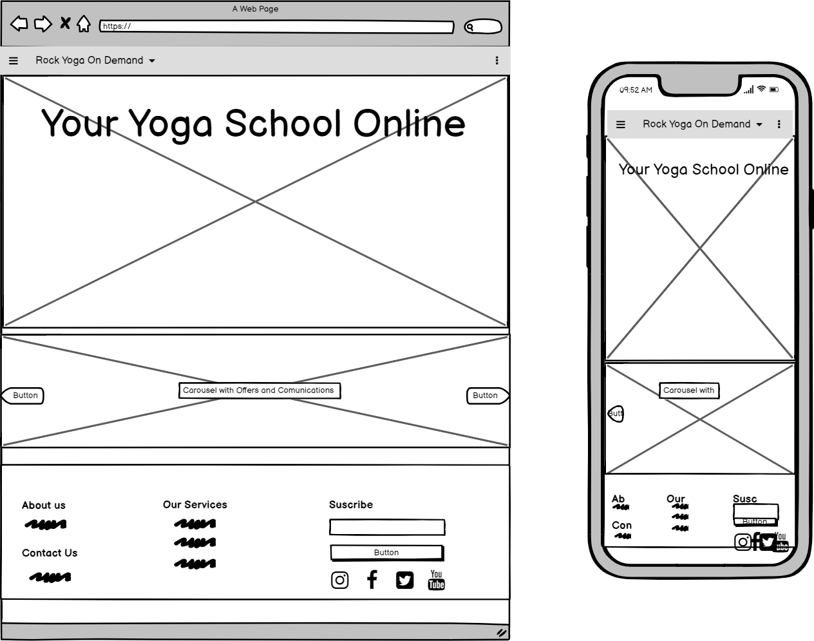
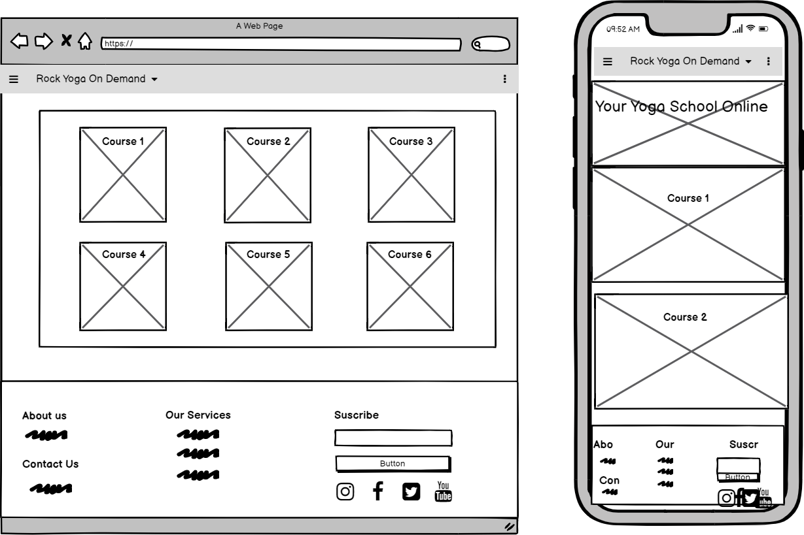
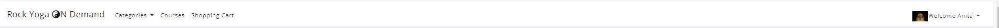

Bugs -Tumbdnail.image

Bug -Sections Modal (Sections HTML), I was using the wrong object in the Video Modal Foreign key 

Bug -hero video, It wasing working because the video was storage in the media_root file, I did move into the static, and create a folder named video. Also used the  tag and them simply used the relatifve phile path of the video.mp4 in the vide src

Developing testing = BDD => tO TES THE DATABASE with models i udes db Borwser and (Video 6. Section 3 Using fixtures to provide initial data for models in Database) python3 manage.py loaddata categrories.json

# Rock Bristol Yoga On  Demand

# A responsive web apllication where the users can PURCHASE Yoga courses in Video format.

## Code Institute - Milestone Project 4

## HTML/ CSS / JavaScript / Python / Django /  - Full Stack Development Milestone Project 3.

### By Manuel Perez

## Table of Content

[View Repository in GitHub Pages](https://github.com/Manuperezro/YogaCourses-MSP4)

[View Deployment link Heroku](https://myrecipes-notebook.herokuapp.com/)

<small><i><a href='http://ecotrust-canada.github.io/markdown-toc/'>Table of contents generated with markdown-toc</a></i></small>

## The Why

This website is an E-commerce video platform which work as an extension of a real Yoga Studio, to offer Videos Courses to their students who can't attend Phisically to the studio classes o the ono who prefer to learm and practise at home and at differents times. 

## The Bussines Goal

+ Increase the number of users.  
+ Increase the income of the Yoga studio and expands their number customers from only In-studio customers, to online customers.

## (UX) User Experience: 

Users will be able to navigate through the web application easily and find the Video-courses they are looking for.

Users will be able to purchase the Video courses.

User will be able top create an Shopping  cart to store Video-Courses prior purchase

- ### User Stories

  - #### First time Users Goals:
     - be able to use the website easily.
     - be able to purchase products easily.
     - be able to save products in the shopping cart.
     - be able to procced with a secure online payment system.
     - be able to create an account, login and logout.
     - be able to browse through all courses available for purchase

  - #### Returning Users Goals:
     - To find the list of producst saved in their shopping cart .
     - To be able to modify information in their profiles.
     - To be able to see the companies social media.
     - To be able to contact the organization.
     - Purchase with ease and confidence
     - To view and edit my shopping basket
     - Have a page with my information given such as name, address, email etc
     
  - #### Frequent Users Goals:
     - To see if there is any new Update or New course in the app.

  - #### Website Owner Goals:
      - As a site owner/admin user, I would like to
      - Edit products on the websites for reasons such as typo errors, pricing etc
      - Add and Remove products
      - Approve and then post of blogs by users/members

  - ### I want users to:

     - To be able to navigate intuitive and whithout many instructions.
     - To be able to enjoy the service that the app offers wihtout errors.
     - To be able to purchase as many Videos-Courses as they want.
     - To be able to open the link of the Video-Courses in a few clicks.

## **THE 5 PLANES** 
### **Strategy** 
- Purpose of the website? To be able to purchase art works to raise money for the charity 

- Target audience? Art enthusiasts who also care about social disadvantages from around the world 

- Value to the user? Have a great selection of art works to choose from whist also knowing their money will go to a good cause 

- What makes a good experience? 
    * An easy to navigate website where they will never be more than a few clicks away to the important destinations 
    * A non-cluttered appearance to avoid over irritable stimulation 
    * An easy purchasing process 
    * A consistent theme to the website 
    * Sufficient information regarding the directly to the product and non direct information of the product such as delivery and what the company is about 

- How are we different? No other website has part of the financial part of the purchases go to a charity 

- What we shouldn’t do? 
    * Make purchasing difficult as purchasing will be the main source of income 
    * Not registering should not have the same experience as registered users’ registered user should have a better experience in the form of offers, convenience etc 

    ## Design:

   ### Theme and Colour Scheme

The Black-Gold Color Scheme palette has 5 colors which are Chinese Black (#151515), Vampire Black (#0A0A0A), Light Goldenrod Yellow (#FBFCD4), Golden Yellow (#FFDD03) and Golden Poppy (#FBC403).

This color combination was created by user Manish. The Hex, RGB and CMYK codes are in the table below.

#### Color By color: 

Here an explanation of the 3 mains color of the pallete.

Black:

The color black has always fared well with versatility and elegance. Black signifies simplicity and functionality. This color works best in modern interior design and architecture.

On a psychological front, an all-black room can be overwhelming and gloomy. However, if you pair the color with red, white, blue, or almost anything else, it provides excellent contrast.

Contrary to popular belief, the color black is an excellent addition to interior design, especially in the kitchen, living room, dining area, and bathroom. With this color scheme, form follows function and accommodates simplistic design trends.

Emotions associated with the color Black are:

Functionality, Simplicity.

Desire, Protectiveness.

Grimness, Depression, Untidiness, Terror.

Elegance, Modernism, Sophistication.

Efficiency, Control, Beauty.

Gray:

The color Gray is another neutral color that is highly associated with elegance and style. Although there is some controversy as to the effects of gray on the human mind, if used correctly, it can have quite a positive effect.

Some people do find the color depressing. However, gray can be used as a neutralizer for vibrant color schemes. It is best to avoid using light gray colors on the walls, but you can use dark gray on one wall and surround it with happy colors such as white, yellow, or pink. You can also implement gray colors in furniture in a bright room. It adds elegance and sophistication to the design plan.

In reality, gray invokes different feelings in different people. The various shades of gray can have a calming effect for some people, while it drives others into depression. It is safer to instill gray in textiles rather than wall colors. If you do use it as a dominant room color, make sure to introduce plenty of natural light to make the room feel more welcoming and warm.

Emotions associated with the color Gray are:

Form, Functionality, Productivity, Simplicity.

Gloominess, Depression, Steely.

Strength, Power, Rigidity, Determination, Will Power.

Style, Elegance, Sophistication.

Gold-Yellow:

The color yellow is synonymous with sunshine, thereby spreading the effect of light and happiness. Yellow is also associated with intellect and prosperity, due to its close associations with the color gold.

In interior design, the color yellow is recommended for the kitchen, dining areas, hallways, and bathrooms. The color automatically uplifts people’s spirits making the room feel bright and sunny.

Although most shades of yellow have a positive effect on the psyche, dull yellow colors instigate a feeling of doom, decay, and sickness. It is best to use yellow in its bright shades around the house. Make sure to use it sparingly though, as yellow tends to stimulate uncontrollable emotions. Due to the extreme optimistic effect, a completely yellow room can drive up blood pressure. The brain associates high blood pressure with feelings of anger thus causing people to lose their temper without any provocation.

Yellow also adds a level of sophistication to interior design, especially when it is paired with grey or white. Yellow stucco walls with grey linings and patterns gained quite the popularity in the 90s and it is making a comeback with better quality materials.

Emotions associated with the color Yellow are:

Joy, Happiness, Care, Cordiality.

Intelligence, Excellence, Obedience, Productivity.

Energy, Freshness, Nature.

Caution, Sickness, Doom, Decay, Jealousy.

Optimism, Encouragement.

### Design Brief:

+ Colour:

- Links : 

+ Background:

The Background Video was downnload from n[Pexels](https://www.pexels.com/es-es/).

- background Video:

the goal was to inspire a space where you can feel freedom, free of extress and where you can be able to breath clean and fresh air.

Where the mind can take you to a meditative state without strees and distrumtions easyly.

## Wireframes

The Basic structure of Rock Yoga on Demand was created using: 

  [balsamiq](https://balsamiq.com/).

- PC Mac screen: 

 

 

## Features

 - #### Existing Features:

 - ##### (Main page)
     
   + Navigation bar: 

   - Navigation Menu: I decided to go with a simple and clean navigation bar to keep the feeling of a minimalism Yoga Studio which invite to take a brake and relax.
      
   

   + Courses display list:

   - The users are able to see here all the courses that the platform offers. wich name and price, the imgs are links which if the user purchase the course it redirect the users to the       course content.

    

   + Course detail:

   - Here the users will be able to see A course in detail, accesing to all the content that the course offers will is compose of sections with video tutorials and series.

   + Shopping Cart:

    

    

   + Edit and deleted Recipes
   
   - Once the recipes are created they will be able to acces the recipes item and edit, and delete them

    

   + Recipes History 

   - I decided to create a list where the users can see every created recipe organize from the latest creation till the oldest.

   Users also can see wich type of meal is, and date and time of creation. 

    

   + Registration and Login Form.

   - I also added a registration and Loging Form, where users can Sign up and register to be able to see their own data.

   

   
  

## **TESTING**
### **HTML Testing**
Using - W3C Markup Validator
Errors and Warnings in the .html files have been attended with the help of W3 .html Validator. After alterations, no major errors were found in the .html files; Most were related to the django templates. The few slightly concerning errors have been documented below
| FILE | Result | Comment
--- | --- | --- |
checkout.html | [image](readme/images/w3_checkout.png) | could not resolve error 7
footer.html | [image](readme/images/w3_footer.png) | do not believe a title element is needed regarding error 2 and 3
navigation.html | [image](readme/images/w3_navigation.png) | did not want to alter with error 12 and 13 as it is from Bootstrap and changing of any id names most likely will interfere with the builtin in bootstrap jquery/js

[top](#content)

### **CSS Testing**
| FILE | Result | Notes
base.css | [image](readme/images/w3_base_css.png) | 2 warnings were related to the colours of the background and border of a class element being the same

[top](#content)

### **PEP8 Testing**
* I used pep8online to check whether my .py file codes were PEP8 compliant. I made the changes needed for an All right pass for all .py files.
* After changes were made, an internal server error occured. I had to revert some line of codes (as told to me by my Gitpod terminal) back to its original state for the website to work. More details can be found in ['Bugs and Fixes'](#bugs-and-fixes) section

[top](#content)

### **User Stories Testing**
| AIM | Achieved | Image |
--- | --- | --- | 
**As a first time visitor to the website, I would like to..** 
Be able to browse through all the art work available for purchase | yes | [image1](readme/images/browsing_1.png) [image2](readme/images/browsing_2.png)|
Search for specific art work via the name and/or artist | yes | [image1](readme/images/search_artist_name.png) [image2](readme/images/search_name.png) |
Know basic information of the art work easily such as price, name etc | yes | [image](readme/images/basic_info_of_artwork.png) |
Sorting of products on to make it easier for what I want | yes | [image](readme/images/sorting_artworks.png) |
Read about the company of the website | yes | [image](readme/images/read_about_company.png) |
Be able to communicate with the website as in email, contact number etc | yes | [image1](readme/images/communicate_to_website_1.png) [image2](readme/images/communicate_to_website_2.png) |
Register to the website | yes | [image](readme/images/register_to_website.png) |
Read reviews of the art works | yes | [image](readme/images/read_review.png) | 
Read articles/blogs related to art and the charity sector | yes | [image](readme/images/read_blog_1.png) [image](readme/images/read_blog_2.png) |
Purchase an item | yes | [image](readme/images/purchase_item_1.png) [image](readme/images/purchase_item_2.png) [image](readme/images/purchase_item_3.png) |
**As a registered member to the website, I would like to..** 
Purchase with ease and confidence | yes | [image](readme/images/easy_purchase_1.png) [image](readme/images/easy_purchase_2.png) |
View and edit my shopping basket | yes | [image](readme/images/view_and_edit_1.png) [image](readme/images/view_and_edit_2.png) |
Know about my previous purchases/orders | yes | [image](readme/images/previous_orders.png) |
Have a page with my information given such as name, address, email etc | yes | [image](readme/images/my_information.png) | 
Create a favourite/likes list | yes | [image](readme/images/wishlist.png) |
Post reviews of the art works | yes | [image](readme/images/post_review.png) |
Post articles/blogs related to art and the charity sector | yes | [image](readme/images/request_blog_post.png) |
**As a site owner/admin user, I would like to..**
Edit products on the websites for reasons such as typo errors, pricing etc | yes | [image](readme/images/edit_product_1.png) [image](readme/images/edit_product_2.png) [image](readme/images/edit_product_3.png) |
Add and remove products | yes | [image delete 1](readme/images/delete_product.png) [image delete 2](readme/images/delete_product_2.png) [image add](readme/images/add_product.png) |
Add and remove reviews | yes | |
Approve and then post of blogs by users/member | yes | [image](readme/images/approve_blog.png) |
**As a user in the process of purchasing, I would like to..** 
A secured payment system | yes | |
Be acknowledged of how secure the process is for peace of mind | yes | |
Edit my basket such as deleting an item, changing the quantity etc | yes | |
Have a confirmation message | yes | [image](readme/images/purchase_approval.png) |

[top](#content)

### **Cross Platfrom Testing**

#### CRUD (create, read, update, delete) TESTING
| AIM | admin | registered user | non-registered user |
--- | --- | --- | --- |
**Products/art works - from products app**
CREATE a product to add to the database | yes | no(as intended) | no(as intended)
READ/see a product from the database on the website | yes | yes | yes
UPDATE a product | yes | no(as intended) | no(as intended)
DELETE a product | yes | no(as intended) | no(as intended)
**Blogs - from blogs app**
CREATE a blog post to add to the database | yes | yes | no(as intended)
READ a blog from the website on the website | yes | yes | yes
UPDATE a blog | no(as intended) | no(as intended) | no(as intended)
DELETE a blog | yes | no(as intended) | no(as intended)
**Reviews - from products app**
CREATE a review | yes | yes(if previously purchased the item) | no(as intended)
READ a review | yes | yes | yes
UPDATE a review | no(as intended) | no(as intended) | no(as intended)
DELETE a review | yes | yes | no(as intended)
**Crate - from crate app**
CREATE a crate | yes | yes | yes
READ a crate | yes | yes | yes
UPDATE a crate | yes | yes | yes
DELETE a crat | yes | yes | yes
**Wishlist - from wishlist app**
CREATE a wishlist | yes | yes | no(as intended)
READ a wishlist | yes | yes | no(as intended)
UPDATE a wishlist | yes | yes | no(as intended)
DELETE from wishlist | yes | yes | no(as intended)

[top](#content)

### FORM VALIDATION TESTING
| AIM | SM | MD | LG |
--- | --- | --- | --- |
**Register** 
'E-mail' field must have follow the pattern of have a '@' and a '.' in the email. It won't accept if it does not | yes | yes | yes
Both 'E-mail' fields must match | yes | yes | yes
'Username' field must only contain letters, numbers, and @/./+/-/_ characters | yes | yes | yes
Both 'Password' fields must match | yes | yes | yes
**Login**
'Login' field must match with user from the database | yes | yes | yes
'Password' field must match with the password made for user entered in the 'Login' field | yes | yes | yes
**Checkout - checkout.html**
'Full Name' field will only accept upto 50 characters | yes | yes | yes
'E-mail' field must have follow the pattern of have a '@' and a '.' in the email | yes | yes | yes
'Phone Number' field will only accept numbers and a maximum of 20 numbers | yes | yes | yes
'Street Address 1' field will only accept upto 80 characters | yes | yes | yes
'Street Address 2' field will only accept upto 80 characters | yes | yes | yes
'Town or City' field will only accept upto 40 characters | yes | yes | yes
'County, State, or Locality' field will only accept upto 80 characters | yes | yes | yes
'Postcode' field will only accept upto 20 characters | yes | yes | yes
'Card number' field will only accept numbers | yes | yes | yes
**Add product - add_product.html**
'Category' will have a drop down containing options from the Category database | yes | yes | yes
'Name' will allow upto 80 characters | yes | yes | yes
'Artist name' will only allow upto 80 characters | yes | yes | yes
'Description' will allow upto 500 characters | yes | yes | yes
'Price' will only accept numbers. It will take a numbers upto 4 digits in length | yes | yes | yes
'Price' will not go lower than 0 | yes | yes | yes
'Image url' field will accept only urls | yes | yes | yes
'Image' will only let image files to be uploaded | yes | yes | yes
**Create Blog - create_blog.html**
'Title' field will accept upto 100 characters | yes | yes | yes
'Article' field has no limits to ammount of characters | yes | yes | yes
'Image' field will only accept image files | yes | yes | yes
**Reviews - product_detail.html**
'Title' field will accept upto 100 characters | yes | yes | yes
'Review' field will accept upto 1000 characters | yes | yes | yes
**Contact us - index.html**
'Name' field will accept upto 100 characters | yes | yes | yes
'E-mail' field must have follow the pattern of have a '@' and a '.' in the email | yes | yes | yes

[top](#content)

### Lighthouse testing
I used Google Chrom Lighthouse testing to find out the quality of the website. Here are my results: [image](readme/images/lighthouse_testing.png)

[top](#content)

### Responsive Testing
AIM | SM | MD | LG |
--- | --- | --- | --- |
**HOME - index.html**
Links / URLs | yes | yes | yes
Images | yes | yes | yes
Renders as expected | yes | yes | yes
**PRODUCTS - products.html**
Links / URLs | yes | yes | yes
Images | yes | yes | yes
Renders as expected | yes | yes | yes
**PRODUCT DETAIL - product_detail.html**
Links / URLs | yes | yes | yes
Images | yes | yes | yes
Renders as expected | yes | yes | yes
Form validation | yes | yes | yes
**EDIT PRODUCT - edit_product.html**
Links / URLs | yes | yes | yes
Images | yes | yes | yes
Renders as expected | yes | yes | yes
Form validation | yes | yes | yes
**ADD PRODUCT - add_product.html**
Links / URLs | yes | yes | yes
Images | yes | yes | yes
Renders as expected | yes | yes | yes
Form validation | yes | yes | yes
**CRATE - crate.html**
Links / URLs | yes | yes | yes
Images | yes | yes | yes
Renders as expected | yes | yes | yes
**CHECKOUT - checkout.html**
Links / URLs | yes | yes | yes
Images | yes | yes | yes
Renders as expected | yes | yes | yes
**CHECKOUT SUCCESS - checkout_success.html**
Links / URLs | yes | yes | yes
Images | yes | yes | yes
Renders as expected | yes | yes | yes
**WISHLIST - wishlist.html**
Links / URLs | yes | yes | yes
Images | yes | yes | yes
Renders as expected | yes | yes | yes
**BLOGS - blogs.html**
Links / URLs | yes | yes | yes
Images | yes | yes | yes
Renders as expected | yes | yes | yes
**READ BLOG - read_blog.html**
Links / URLs | yes | yes | yes
Images | yes | yes | yes
Renders as expected | yes | yes | yes
**CREATE_BLOG - create_blog.hmtl**
Links / URLs | yes | yes | yes
Images | yes | yes | yes
Renders as expected | yes | yes | yes
Form validation | yes | yes | yes
**REQUESTED BLOG - requested_blog.html**
Links / URLs | yes | yes | yes
Images | yes | yes | yes
Renders as expected | yes | yes | yes
Form validation | yes | yes | yes
**PROFILE - profile.html**
Links / URLs | yes | yes | yes
Images | yes | yes | yes
Renders as expected | yes | yes | yes
**UPDATE PROFILE - update_profile.html**
Links / URLs | yes | yes | yes
Images | yes | yes | yes
Renders as expected | yes | yes | yes
Form validation | yes | yes | yes

[top](#content)

### Bugs and Fixes
ISSUE | Solved? | How? | link
--- | --- | --- | --- | 
It was not possible to NOT save the changes made in teh checkout form in checkout.html | Yes | Thanks to helpful student peers (Phillip and Luke) from the Slack community, they posted the required code needed for the checkbox to work with the .js, .html, and .py files. | (https://code-institute-room.slack.com/archives/C7HS3U3AP/p1605302104469800?thread_ts=1605222094.452700&cid=C7HS3U3AP) and (https://code-institute-room.slack.com/archives/C7HS3U3AP/p1621881386435800?thread_ts=1605222094.452700&cid=C7HS3U3AP) 
inernal server occured after PEP8 chnages | yes | Gitpod terminal told me whre the errors were occuring. Reverted the codes back to its state before the PEP8 changes | [image](readme/images/bugs_and_fixes_pep8.png)

[top](#content)

## **DEPLOYMENT**
### Making a local clone
You may want to have access via a copy of the repository on your own device. There are three ways to do this: 
* Method 1
1. Login to your GitHub account and open up the repository you would like to copy 
2. Click on the button with a drop-down menu named ‘Code’ which will be placed next to the green ‘Gitpod’ button
3. You will then have the option to download it on to your system via the ‘Download ZIP’ option

* Method 2 
1. Open up your preferred IDE and open up the folder where you would the repository to be copied/cloned
2. In the terminal, type in ‘git clone’ ; do not press enter or anything else
3. Now login to your GitHub account and open up the repository you would like to copy
4. Click on the ‘Code’ button again and copy the text given under the subheading ‘HTTPS’. A button next to this text gives you an easier way of copying the text
5. Back to your IDE terminal, after the ‘git clone’, press the spacebar button and paste in the link you copied from the repository. Your entry in the terminal should look something like this: ‘gti clone https://github.com/shiba517/msp4_gallery_five.git’. Then press enter
6. Your terminal will let you know the repository has been cloned and saved to your preferred destination and will be evident when viewing files and folders from your preferred destination

[top](#content)

### Working with a local clone
1. Install all the requirements from requirements.txt by typing in 'pip3 install -r requirements.txt' into your terminal
2. Create a .gitignore from the root of your project
3. Create a env.py from the root of your project and have it look like this: [image](readme/images/env_py_file.png)
4. Include env.py into .gitignore
5. Create a Stripe account
    * Under the 'Developers' tab, click on 'Webhooks'
    * Click on '+ Add endpoint' and enter in the your URL followed by 'checkout/wh/', and check recieve all events
6. In your env.py file, fill out the second parameter of every os.environ line with the following:
    * "SECRET_KEY" can be anything you want
    * "STRIPE_PUBLIC_KEY" can be found from your Stripe account under the name of 'Publish key'
    * "STRIPE_SECRET_KEY" can be found in your Stripe account under the name of 'Secret key'
    * "STRIPE_WH_SECRET" can be found in your 'endpoint' tab from your Strip account under the name of 'signing secret'
7. An admin/super_user will need to be created. To do so, type in 'python3 manage.py createsuperuser'; and follow the instructions
8. Now it is time load up your django with the initial files/data and databases. You can do so by tyoing into your terminal the following:
    * python3 manage.py makemigrations
    * python3 manage.py migrate
    * python3 manage.py loaddata categories
    python3 manage.py loaddata products
9. You are now done. To get access to your admin, run the server ('python3 manage.py runserver') and type in'/admin' at teh end of your url

[top](#content)

### Deploying to Heroku
1. Install all the requirements from requirements.txt by typing in 'pip3 install -r requirements.txt' into your terminal
2. Create a Heroku account
    * Under 'Add-ons', find Heroku-Postgress and provision  it
3. Follow step 8 and 7 from the previous sub title(Working wiht a local clone)
4. In settings.py, replace and/or add the url of your Heroku app in teh variable 'ALLOWED_HOSTS'
5. If you would like quick deployment to Heroku, add your repository to Heroku under Deploy > Connect to Github > Enable automatic deploys

### Hosting files with AWS
1. Create and AWS account
2. Under S3 services, create a new bucket
    * Uncheck 'Block all public access'
3. In your newly created bucket, enable Static Web Hosting from the tab Properties
4. Under the 'Permissions' tab, make the following changes:
    * 'Bucket policy' > policy generator
        * Select Type of Policy = select 'S3 Bucket Policy'
        * Principle: type in '*'
        * Actions: select 'GetObject'
        * Amazon Resource Name(ARN): you should find this from the previus windown under the 'Bucket policy' tab
        * Add statement > Generaate policy. Copy given code
        * Paste the code in the editor under the 'Bucket policy tab and add '/*' at the end of "Resource" image
        * Click save
5. Under IAM services, create a new 'user group'
6. Access management > Policies > Create policy
    * Under JSON tab, click on 'Import Managed policy' and import 'AmazonS3FullAccess'
    * Now under the JSON tab, include your ARN twice in the 'Resources' with the second follewed by '/*'
    * Click on 'Review policy', fill out the name and description, and finally click on 'Create policy'
7. Go to the page of the group you created
    * Under 'Permissions' > Attach Policy, select for the policy you have just created and click 'Attach policy'
8. Access management > Users > Add user. Give it a name and check 'Access type'
    * Progress on to last step without changes and click 'Create user'
    * Download the .csv file and save it somewhere secure as you will NOT be able to download it again once you naviate away from this page
9. In settings.py, change the AWS_STORAGE_BUCKET_NAME to the name of your AWS bucket and AWS_S3_REGION_NAME to your region which you can find in your AWS account
10. In teh S3 services, add a new colder named 'media'
    * Upload your images, Select 'Grant public read access to this objects(s)' and finally 'upload'
11. From your Stripe account, click '+ Add endpoint' and enter in the your Heroku URL followed by 'checkout/wh/', and check recieve all events
12. Your 'Config Vars' from your Heroku account (under Settings) should look like this: [image](readme/images/heroku_config_look.png)
    * AWS_ACCESS_KEY_ID can be found from your AWS account
    * AWS_SECRET_ACCESS_KEY can be found from your AWS account

[top](#content)

### Setting up a real active email service
1. Create a Gmail account
2. go to Settings > Accounts and Import > Other Google account settings
    * Click on 'Security' tab and enable 2-step verification
3. Back to 'Security' tab, click on 'App passwords'
    * for 'Select app', select 'Mail'
    * for 'Select device', select 'other'
    * Name your app password and click 'GENERATE'; You will then be given a password
    * Copy and paste the password and add it to your Heroku config variable under the name of 'EMAIL_HOST_PASS'
4. Whilst on the config variable, add another under the name of 'EMAIL_HOST_USER' with its value being your email address

[top](#content)

## **CREDITS**
### References
* REF001 - 'profile' app was heavily copied/slightly adapted from Code Insitute Full Stack Frameworks with Django module (https://learn.codeinstitute.net/courses/course-v1:CodeInstitute+FSF_102+Q1_2020/courseware/4201818c00aa4ba3a0dae243725f6e32/2c1b98a8efb748009445d5056c97483b/)
* REF002 - 'checkout' app was heavily copied/slightly adapted from Code Insitute Full Stack Frameworks with Django module (https://learn.codeinstitute.net/courses/course-v1:CodeInstitute+FSF_102+Q1_2020/courseware/4201818c00aa4ba3a0dae243725f6e32/326f171b831446588d33c0333eb4caaa/)
* REF003 - 'crate' app was heavily copied/slightly adapted from Code Insitute Full Stack Frameworks with Django module (was heavily copied/slightly adapted from Code Insitute Full Stack Frameworks with Django module)

[top](#content)

### Content
* I copied and pasted [lorem ipsum](https://www.lipsum.com/) texts into the products details due to the nature of the project
* About us written content was written by me

[top](#content)

### Media
* [Jeremy Bezanger](https://unsplash.com/photos/NsdNBQxb-8s)
* [Antonino Cicero](https://unsplash.com/photos/_5puSofcfOs)
* [Pascal Bernardon](https://unsplash.com/photos/1wOv0s1oR4A)
* [Nick Kwan](https://unsplash.com/photos/FeBoOVQv0sQ)
* [Jeremy Bezanger](https://unsplash.com/photos/rCefTI3jS2Y)
* [Bees And Green Tea](https://unsplash.com/photos/WqjW5em9S5o)
* [Jeremy Bezanger](https://unsplash.com/photos/7vGDT1Ygbl4)
* [Jorge Zapata](https://unsplash.com/photos/TPPzDKIvROw)
* [Timothy Dykes](https://unsplash.com/photos/KTYSVnv6lUw)
* [Pegah Mostafavi Zade](https://unsplash.com/photos/w-ImBSMvpZM)
* [Trude Jonsson Stangel](https://unsplash.com/photos/TO_h3akXWf0)
* [Vika Wendish](https://unsplash.com/photos/h4PSY635040)
* [Matt Seymour](https://unsplash.com/photos/rSKjPA41H2Q)
* [Vika Wendish](https://unsplash.com/photos/PFmk0-yVKzI)
* [adr sree](https://unsplash.com/photos/sWvbhOTl09o)
* [Earl Wilcox](https://unsplash.com/photos/j_9wznLtfKk)
* [Misael Moreno](https://unsplash.com/photos/14HNtFPbKbs)
* [Kevin Bluer](https://unsplash.com/photos/e6XqFP4kCxM)
* [Mattias Russo-Larsson](https://unsplash.com/photos/GQ8JIFHHmCg)
* [denis pan](https://unsplash.com/photos/FnNIDG9k8Ag)
* [Stavrialena Gontzou](https://unsplash.com/photos/jyE-TqbRy3Y)
* [Casey Horner](https://unsplash.com/photos/Ms77GfPPT48)
* [Jan Gottweiss](https://unsplash.com/photos/SCTALD23uXA)
* [Oneisha Lee](https://unsplash.com/photos/r3WFKMR9zzI)
* [Mika](https://unsplash.com/photos/y-RjWd6Ol7A)
* [Matteo Vistocco](https://unsplash.com/photos/mJUpopBUGsg)
* [Matt Moloney](https://unsplash.com/photos/tKB1GDJUq9c)
* [Jen Theodore](https://unsplash.com/photos/PU4sOcNnYj8)
* [Katie Rainbow](https://unsplash.com/photos/DjGHuzUh_84)
* [Karim MANJRA](https://unsplash.com/photos/fm9wqDNXyQ0)
* [Avinash Kumar](https://unsplash.com/photos/u3B4oNyXYXE)
* [Tim Hufner](https://unsplash.com/photos/QtL46PrOg9E)
* [Oscar Helgstrand](https://unsplash.com/photos/HPwbniZ9g6Q)
* [Matt Moloney](https://unsplash.com/photos/lYENI1CYeP0)
* [Matt Moloney](https://unsplash.com/photos/cJL2LuBTu0A)
* [Anil Kumar](https://unsplash.com/photos/dBkT44qZD6M)
* [Ezi](https://unsplash.com/photos/ZcY6QeXg_J4)
* [Alexander Shatov](https://unsplash.com/photos/DHl49oyrn7Y)
* [Benjamin henon](https://unsplash.com/photos/2JlLdOm1xIs)
* [Mingwei Lim](https://unsplash.com/photos/Q1Us6ITDPeo)
* [Fakurian Design](https://unsplash.com/photos/nNpLEEdmUj0)
* [KOBU Agency](https://unsplash.com/photos/csJt89dL9pE)
* [Pink flip](https://unsplash.com/photos/1BcfKfeavVA)
* [ueberform](https://unsplash.com/photos/eejq0xM2RTk)
* [Europeana](https://unsplash.com/photos/6c43FgRt0Dw)
* [Vojtech Bruzek](https://unsplash.com/photos/mCjA1I8SlS8)
* [Europeana](https://unsplash.com/photos/TjegK_z-0j8)
* [Matthew Brindle](https://unsplash.com/photos/p7ILrZmhHHc)
* [Federico Di Dio](https://unsplash.com/photos/XVOBr3F95RY)
* [Adrianna Geo](https://unsplash.com/photos/1rBg5YSi00c)
* [Europeana](https://unsplash.com/photos/Wiad3DQxUho)
* [Steve Johnson](https://unsplash.com/photos/iBlW9tjiyqw)
* [Paul Blenkhorn](https://unsplash.com/photos/PkDnu0lImv4)
* [Sir Edward Burne-Jones](https://unsplash.com/photos/tV02AFxvRJg)
* [David Roberts](https://unsplash.com/photos/sJr8LDyEf7k)
* [Frederick Sandys Greek](https://unsplash.com/photos/aE0-ZJb2VTQ)
* [Michael Angelo](https://unsplash.com/photos/1rBg5YSi00c)
* [Fuu J](https://unsplash.com/photos/KRztl5I6xac)
* [McGill Library](https://unsplash.com/photos/eMw-fVXNpME)
* [Sir David Wilkie](https://unsplash.com/photos/XSMTwl7n3p4)
* [Francis Towne](https://unsplash.com/photos/5ruS8plfbvM)
* [Robert Hills](https://unsplash.com/photos/6fv0MEf3FUE)

[top](#content)

### Acknowledgement 
* Code Institue course
* Course tutor Precious Ijege
* [W3Schools](https://www.w3schools.com/)
* [Codemy](https://www.youtube.com/c/Codemycom)
* [Very Academy](https://www.youtube.com/c/veryacademy)
* [The Net Ninja ](https://www.youtube.com/c/TheNetNinja)
* [Cryce Truly](https://www.youtube.com/c/CryceTruly)

[top](#content)

## **DISCLAIMER**
This webite was built for educational reasons for my coding course from Code Institute. No content, written(unless mentioned in CREDITS - Content of this document) and imagery, is of mine. No offense was intentionaly made with the pricing of the art works (I randomly made up the numbers), and any namings of art works. If there is anything you would like enquire, please do so via my email - shibacdeb@gmail.com

[top](#content)