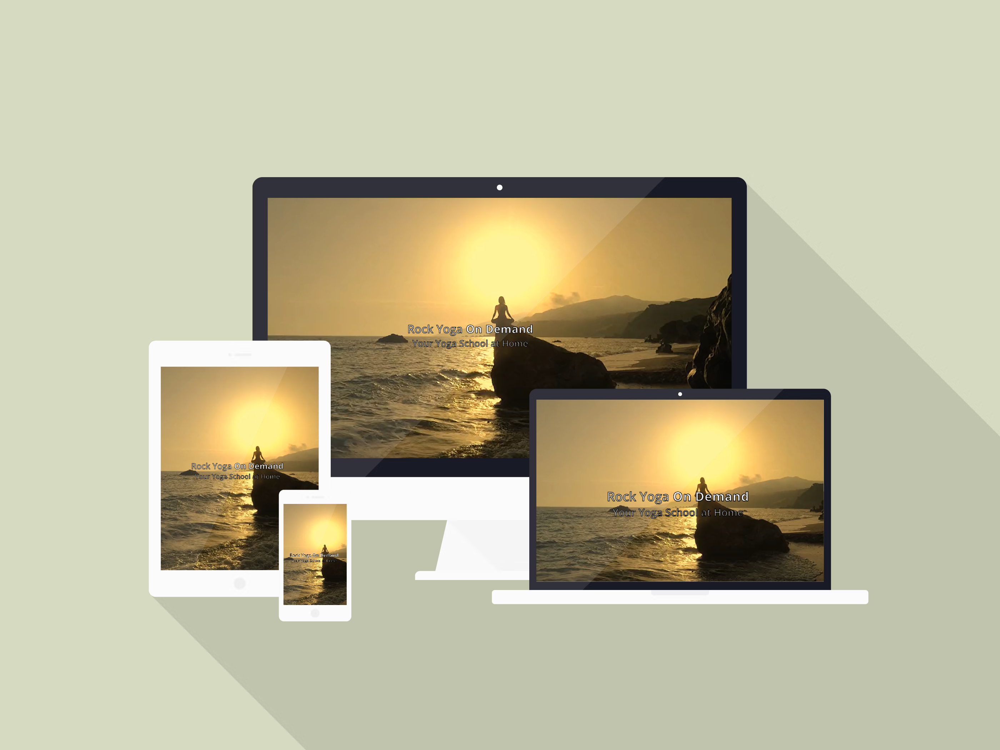
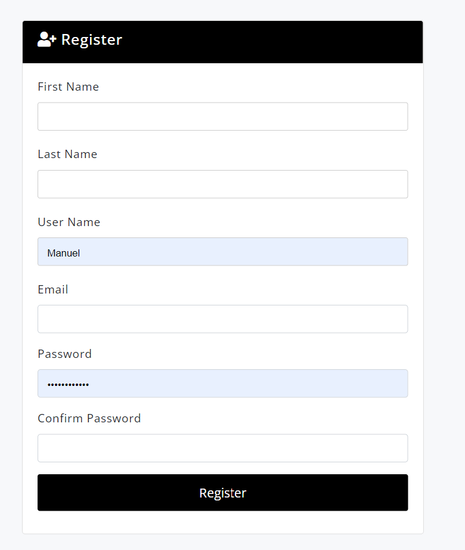
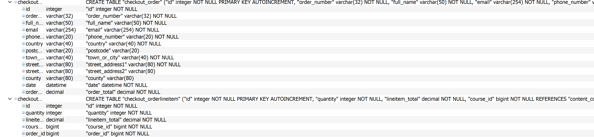

# Rock Bristol Yoga On  Demand

# A responsive web application where the users can PURCHASE Yoga courses in Video format.

## Code Institute - Milestone Project 4

## HTML/ CSS / JavaScript / Python / Django /  - Full Stack Development Milestone Project 4.

### By Manuel Perez

### Repository Link

[View Repository in GitHub Pages] (https://github.com/Manuperezro/YogaCourses-MSP4)

### Live Project Link

[View Deployment link Heroku] (https://rockyoga.herokuapp.com/)

## Table of Content

- [content](#content)
  * [The Why](#the-why)
  * [The Business Goal](#the-business-goal)
  * [(UX) User Experience:](#-ux--user-experience-)
    + [User Stories](#user-stories)
      - [First time Users Goals:](#first-time-users-goals-)
      - [Returning Users Goals:](#returning-users-goals-)
      - [Website Owner Goals:](#website-owner-goals-)
      - [As a user in the process of purchasing, I would like to..**](#as-a-user-in-the-process-of-purchasing--i-would-like-to--)
  * [**THE 5 PLANES**](#--the-5-planes--)
    + [**Strategy**](#--strategy--)
  * [Design:](#design-)
    + [Theme and Colour Scheme](#theme-and-colour-scheme)
      - [Colour By colour:](#colour-by-colour-)
    + [Design Brief:](#design-brief-)
  * [Wireframes](#wireframes)
  * [Features](#features)
      - [Existing Features:](#existing-features-)
        * [Navigation bar:](#navigation-bar-)
        * [Courses display list:](#courses-display-list-)
        * [Course detail:](#course-detail-)
        * [Video Detail:](#video-detail-)
        * [Shopping cart](#shopping-cart)
        * [Checkout](#checkout)
        * [Registration and Login Form.](#registration-and-login-form)
  * [Future Features I will like to include.](#future-features-i-will-like-to-include)
        * [Download the content](#download-the-content)
        * [Membership Options](#membership-options)
        * [Yoga API](#yoga-api)
  * [**DATABASES**](#--databases--)
    + [**Models Flow Chart**](#--models-flow-chart--)
      - [Content Data Base:](#content-data-base-)
      - [Checkout Data Base:](#checkout-data-base-)
      - [Acconts Data Base:](#acconts-data-base-)
  * [**TESTING**](#--testing--)
    + [**HTML Testing**](#--html-testing--)
    + [**CSS Testing**](#--css-testing--)
    + [**PEP8 Testing**](#--pep8-testing--)
    + [**User Stories Testing**](#--user-stories-testing--)
    + [**Cross Platfrom Testing**](#--cross-platfrom-testing--)
      - [CRUD (create, read, update, delete) TESTING](#crud--create--read--update--delete--testing)
    + [FORM VALIDATION TESTING](#form-validation-testing)
    + [Lighthouse testing](#lighthouse-testing)
    + [Responsive Testing](#responsive-testing)
    + [Jest Test Testing Javascript:](#jest-test-testing-javascript-)
        * [I used Jest test to set some of the functions I create with Javascript.](#i-used-jest-test-to-set-some-of-the-functions-i-create-with-javascript)
    + [Django test Testing Python code, views and Models:](#django-test-testing-python-code--views-and-models-)
        * [I used Django tests to set some models and views I cretes  with Python.](#i-used-django-tests-to-set-some-models-and-views-i-cretes--with-python)
    + [Bugs and Fixes](#bugs-and-fixes)
    + [Remainding Errors in the Google Developers Tool Console:](#remainding-errors-in-the-google-developers-tool-console-)
  * [**DEPLOYMENT**](#--deployment--)
    + [Making a local clone](#making-a-local-clone)
    + [Working with a local clone](#working-with-a-local-clone)
    + [Deploying to Heroku](#deploying-to-heroku)
    + [Hosting files with AWS](#hosting-files-with-aws)
    + [Setting up a real active email service](#setting-up-a-real-active-email-service)
  * [**CREDITS**](#--credits--)
    + [References](#references)
    + [Acknowledgement](#acknowledgement)
  * [**DISCLAIMER**](#--disclaimer--)

<small><i><a href='http://ecotrust-canada.github.io/markdown-toc/'>Table of contents generated with markdown-toc</a></i></small>

# content 

## The Why

This Website is an E-commerce video platform which work as an extension of a real Yoga Studio, to offer Video Courses to their Students/Users who can't attend Physically to the In studio classes or the ones who prefer to learn and practise from home at different times. 

## The Business Goal

+ Increase the number of users.  
+ Increase the income of the Yoga studio and expands their number customers from only In-studio customers, to online customers.

## (UX) User Experience: 

Users will be able to navigate through the web application easily and find the Video-courses they are looking for.

Users will be able to purchase the Video courses.

User will be able to create a Shopping cart to store Video-Courses prior purchase

- ### User Stories

  - #### First time Users Goals:
     - Be able to use the website easily.
     - Be able to browse through all the courses available for purchase.
     - Be able to save products in the shopping cart.
     - Be able to procced with a secure online payment system.
     - Be able to Register to the website.
     - Be able to Read about the company of the website

  - #### Returning Users Goals:
     - To be able to find the list of producst saved in their shopping cart.
     - To be able View and edit my shopping basket
     - To Have a page with my information given such as username, email, avatar.
     - To be able to Purchase with ease and confidence

  - #### Website Owner Goals:
     - Edit products on the websites for reasons such as typo errors, pricing etc
     - Add and Remove products

 - #### As a user in the process of purchasing, I would like to..** 
     - secured payment system
     - Be acknowledged of how secure the process is for peace of mind.
     - Edit my basket such as deleting an item, changing the quantity etc..
     - Have a confirmation message.

[top](#content)

## **THE 5 PLANES** 
### **Strategy** 
- Purpose of the website? To be able to purchase Video-Courses 

- Target audience? Yoga enthusiasts who want to practice yoga or mindfulness from and appreciated the advantages of Online classes. 

- Value to the user? Have a great selection of Video-Courses to choose from.

- What makes a good experience? 
    * An easy to navigate website where they will never be more than a few clicks away to the important destinations 
    * A non-cluttered appearance to avoid over irritable stimulation 
    * An easy purchasing process 
    * A consistent theme to the website 
    * Sufficient information regarding the directly to the product and non direct information of the product such as categories and what the company is about 

- What we shouldn’t do? 
    * Make purchasing difficult as purchasing will be the main source of income 
    * Not registering should not have the same experience as registered users’ registered user should have a better experience in the form of offers, convenience etc 

    ## Design:

   ### Theme and Colour Scheme

Yellow And Gray Color Scheme

The Yellow And Gray Colour Scheme palette has 5 colours which are Platinum (#E3E3E3), Light Gray (#D6D4D2), Middle Grey (#8B8680), Golden Yellow (#FFDF00) and Spanish Yellow (#EFB90A).

#### Colour By colour: 

Here an explanation of the 3 mains colour of the palette.

Black:

The colour black has always fared well with versatility and elegance. Black signifies simplicity and functionality. This colour works best in modern interior design and architecture.

On a psychological front, an all-black room can be overwhelming and gloomy. However, if you pair the colour with red, white, blue, or almost anything else, it provides excellent contrast.

Contrary to popular belief, the colour black is an excellent addition to interior design, especially in the kitchen, living room, dining area, and bathroom. With this colour scheme, form follows function and accommodates simplistic design trends.

Emotions associated with the colour Black are:

Functionality, Simplicity.

Desire, Protectiveness.

Grimness, Depression, Untidiness, Terror.

Elegance, Modernism, Sophistication.

Efficiency, Control, Beauty.

Gray:

The colour Gray is another neutral colour that is highly associated with elegance and style. Although there is some controversy as to the effects of Gray on the human mind, if used correctly, it can have quite a positive effect.

Some people do find the colour depressing. However, Gray can be used as a neutralizer for vibrant colour schemes. It is best to avoid using light Gray colours on the walls, but you can use dark Gray on one wall and surround it with happy colours such as white, yellow, or pink. You can also implement Gray colours in furniture in a bright room. It adds elegance and sophistication to the design plan.

In reality, gray invokes different feelings in different people. The various shades of gray can have a calming effect for some people, while it drives others into depression. It is safer to instil Gray in textiles rather than wall colors. If you do use it as a dominant room color, make sure to introduce plenty of natural light to make the room feel more welcoming and warm.

Emotions associated with the color Gray are:

Form, Functionality, Productivity, Simplicity.

Gloominess, Depression, Steely.

Strength, Power, Rigidity, Determination, Will Power.

Style, Elegance, Sophistication.

Gold-Yellow:

The color yellow is synonymous with sunshine, thereby spreading the effect of light and happiness. Yellow is also associated with intellect and prosperity, due to its close associations with the color gold.

In interior design, the color yellow is recommended for the kitchen, dining areas, hallways, and bathrooms. The color automatically uplifts people’s spirits making the room feel bright and sunny.

Although most shades of yellow have a positive effect on the psyche, dull yellow colors instigate a feeling of doom, decay, and sickness. It is best to use yellow in its bright shades around the house. Make sure to use it sparingly though, as yellow tends to stimulate uncontrollable emotions. Due to the extreme optimistic effect, a completely yellow room can drive up blood pressure. The brain associates high blood pressure with feelings of anger thus causing people to lose their temper without any provocation.

Yellow also adds a level of sophistication to interior design, especially when it is paired with grey or white. Yellow stucco walls with grey linings and patterns gained quite the popularity in the 90s and it is making a comeback with better quality materials.

Emotions associated with the color Yellow are:

Joy, Happiness, Care, Cordiality.

Intelligence, Excellence, Obedience, Productivity.

Energy, Freshness, Nature.

Caution, Sickness, Doom, Decay, Jealousy.

Optimism, Encouragement.

### Design Brief:

+ Colour:

- Links : 

+ Background:

The Background Video was download from n[Pexels](https://www.pexels.com/es-es/).

Even If use of a background Video is considered as bad practice for UX I decided to go for it, to get the experience of implemeting a video in one of my Projects, and practicing with embeded videos, I though it is was a good choice as the website is a Video Platform so can give the users an Idea of what the sites offers, However the video it has a only little movement of the waves wich is not noise at all.

The Video has been selected from a collection of Background videos made it to fulfill this purpose.

- background Video:

the goal was to inspire a space where you can feel freedom, free of stress and where you can be able to breath clean and fresh air.

Where the mind can take you to a meditative state without stress and distributions easily.

[top](#content)

## Wireframes

The Basic structure of Rock Yoga on Demand was created using: 

 [balsamiq](https://balsamiq.com/).

- PC Mac screen: 

 

 

[top](#content)

## Features

 - #### Existing Features:
     
   ##### Navigation bar: 

   - Navigation Menu: I decided to go with a simple and clean navigation bar to keep the feeling of a minimalism Yoga Studio which invite to take a brake and relax.
      
   

   ##### Courses display list:

   - The users are able to see here all the courses that the platform offers. which name and price, the images are links which if the user purchase the course, it redirect the users to the       course content.

    

   ##### Course detail:

   - I Decided to don’t use an auto play video here as it was to noise to navigate through the Content and be able to see all the sections of the courses, so I left the Video    decoration around the course image to create the feeling of a video platform, every single image below in the section will open a video. 
    I did this by modifying the model and removing the url_intro_video. and adding the thumbnail image.   

   - Here the users will be able to see A course in detail, accessing to all the content that the course offers will is compose of sections with video tutorials and series.

   - Also the users will be able to add the course to the shopping cart.

    

   ##### Video Detail:

   - Here the Users will be able to view the videos in full screen, also to move through the different sections of the courses and the other videos using the dropdown list.
  
   
    

   ##### Shopping cart
   
   - The users will be able to add, adjust quantity and remove Courses from the shopping cart once the register and Login
   - For the bag app I follow the videos of the Boutique-Ado, side project from the Diploma in Code Institute, due to the complexity of the code and Stripe. I modify some bits to addapt to the requirements of This project

    

   ##### Checkout 

   - The users will be able to procced with a secure payment, completing the checkout form.
   - For the Checkout app I also follow the videos of the Boutique-Ado, side project from the Diploma in Code Institute, due to the complexity of the code and Stripe. I modify some bits to adapt to the requirements of This project

    

   ##### Registration and Login Form.

   - I also added a registration and Loging Form, where users can Sign up and register to be able to modify the profile data to access to the full content and to purchase videos.

   

   

    ##### Footer.

   - In the footer the users can find all the contact detail, like social media links, phone number, email, and I add a contact form using emailJS where the users can contact the business directly.

   

## Future Features I will like to include.

   ##### Download the content

   - I will like to add the option to download the videos into the users pc after purchase.

   ##### Membership Options

   - I will probably include some memberships options so the users can get access to specific content, depends of the membership they purchase.

   - In this project the content can be access it without actually purchase, as I wanted to create the logic for a shopping cart using in real life e-commerce application with the Idea that DVDs will be sent to the users address without delivery cost.
  

   ##### Yoga API

   - I will include a yoga API which will be used by users to translate some yoga poses from Sanskrit to their English name.

[top](#content)

## **DATABASES**

### **Models Flow Chart**

#### Content Data Base:

#### Checkout Data Base:

#### Acconts Data Base:

## **TESTING**

### **HTML Testing**
Using - W3C Markup Validator
Errors and Warnings in the .html files have been attended with the help of W3 .html Validator. After alterations, no major errors were found in the .html files; Most were related to the Django templates. The few slightly concerning errors have been documented below
| FILE | Result | Comment
--- | --- | --- |
base.html | [image](static/images/base.html-validator.png) | Only the errors regarding to the Django code left. W3validators does not recognize Django syntax as 
_footer.html | [image](static/images/course_list.validator.png) | Only the errors regarding to the Django code left. W3validators does not recognize django syntax as 
_navbar.html| [image](readme/images/w3_navigation.png) |Only the errors regarding to the Django code left. W3validators does not recognize Django syntax as , Also error 6 left, as When I try to change the Div it brakes the dropdown error
video_detail.html | [image](static/images/videodetailvalidator.png) | Only the errors regarding to the Django code left. W3validators does not recognize django syntax as 
home.html | [image](static/images/home.validator.png) | Only the errors regarding to the django code left. W3validators does not recognize django syntax as 
course_list.html | [image](static/images/course_list.validator.png) | Only the errors regarding to the django code left. W3validators does not recognize django syntax as 
course_detail.html | [image](static/images/course_detailvalidator.png) | Only the errors regarding to the django code left. W3validators does not recognize django syntax as 
register.html | [image](static/images/course_list.validator.png) | Only the errors regarding to the django code left. W3validators does not recognize django syntax as 
my_profile.html | [image](static/images/course_list.validator.png) | Only the errors regarding to the django code left. W3validators does not recognize django syntax as 
login.html | [image](static/images/course_list.validator.png) | Only the errors regarding to the django code left. W3validators does not recognize django syntax as 
bag.html | [image](static/images/bag.validator.png) | Only the errors regarding to the django code left. W3validators does not recognize django syntax as 
checkout_success.html | [image](static/images/sucess.validator.png) | Only the errors regarding to the django code left. W3validators does not recognize django syntax as 
checkout.html | [image](static/images/checkout.validator.png) | Only the errors regarding to the django code left. W3validators does not recognize django syntax as 

[top](#content)

### **CSS Testing**
| FILE | Result | Notes
--- | --- | --- |
navbar.css | [image](static/images/noerrors.css.png) | No errors Found
list.css | [image](static/images/noerrors.css.png) | No errors Found
home.css | [image](static/images/noerrors.css.png) | No errors Found
footer.css | [image](static/images/noerrors.css.png) | No errors Found
course_detail.css | [image](static/images/noerrors.css.png) | No errors Found
checkout.css | [image](static/images/noerrors.css.png) | No errors Found
card.css | [image](static/images/noerrors.css.png) | No errors Found
base.css | [image](static/images/noerrors.css.png) | No errors Found
bag.css | [image](static/images/noerrors.css.png) | 1 error found Value Error : font-weight 400px is not a font-weight value : 400px. Fixed

[top](#content)

### **PEP8 Testing**
* I used pep8online to check whether my .py file codes were PEP8 compliant. I made the changes needed for an All right pass for all .py files.

* I test all the views.py urls.py and models.py from all the apps.

* I have to left some errors as (E501: Line too long, and E711: comparison to None should be 'if cond is not None:')
as when I change it.
[top](#content)

### **User Stories Testing**
| AIM | Achieved | Image |
--- | --- | --- | 
**As a first time visitor to the website, I would like to..** 
Be able to browse through all the courses available for purchase | yes | [image1](static/images/Courselist.png) |
Be able to Search for specific courses via categories | yes | [image1](static/images/sorting.png) |
Be able to Know basic information of the Courses easily such as price, name etc | yes | [image1](static/images/Courselist.png) |
Be able to Read about the company of the website | yes | [image](static/images/about.png) |
Be able to communicate with the website as in email, contact number etc | yes | [image1](static/images/contact.png) |
Be able to Register to the website | yes | [image](static/images/register.png) |
Be able to procced with a secure online payment system | yes | [image](static/images/order succesfull.png) |
**As a registered member to the website, I would like to..** 
To be able to find the list of courses saved in their shopping cart | yes | [image](static/images/cart.png) |
To be able View and edit my shopping basket | yes | [image](static/images/cart.png) |
To have a page with my information given such as name, email, avatar | yes | [image](static/images/Profile.png)) | 
To be able to Purchase with ease and confidence | yes | [image]() |
**As a site owner/admin user, I would like to..**
Edit products on the websites for reasons such as typo errors, pricing etc | yes | [image](static/images/admin.png) |
Add and remove products | yes | [image delete 1](readme/images/delete_product.png) [image](static/images/admin.png) |
**As a user in the process of purchasing, I would like to..** 
A secured payment system | yes | |
Be acknowledged of how secure the process is for peace of mind | yes | |
Edit my basket such as deleting an item, changing the quantity etc | yes | |
Have a confirmation message | yes | |

[top](#content)

### **Cross Platfrom Testing**

#### CRUD (create, read, update, delete) TESTING
| AIM | admin | registered user | non-registered user |
--- | --- | --- | --- |
**Courses/art works - from content app**
CREATE a product to add to the database | yes | no(as intended) | no(as intended)
READ/see a product from the database on the website | yes | yes | yes
UPDATE a product | yes | no(as intended) | no(as intended)
DELETE a product | yes | no(as intended) | no(as intended)
**Bag - from bag app**
CREATE a shopping cart(Add products) | yes | yes | no(as intended)
READ the products in the Shopping cart | yes | yes | no(as intended)
UPDATE the products in the Shopping cart | yes | yes | no(as intended)
DELETE the products in the Shopping cart | yes | yes | no(as intended)
**Profile - from accounts app**
CREATE a Users Profile | yes | yes | no(as intended)
READ  username, email, avatar | yes | yes | no(as intended)
UPDATE username, email, avatar | yes | yes | no(as intended)
DELETE a Users Profile | yes | no | no(as intended)

[top](#content)

### FORM VALIDATION TESTING
| AIM | SM | MD | LG |
--- | --- | --- | --- |
**Register** 
'First Name' field must only contain letters, numbers, and @/./+/-/_ characters | yes | yes | yes
'Last Name' field must only contain letters, numbers, and @/./+/-/_ characters | yes | yes | yes
'E-mail' field must have follow the pattern of have a '@' and a '.' in the email. It won't accept if it does not | yes | yes | yes
'Username' field must only contain letters, numbers, and @/./+/-/_ characters | yes | yes | yes
Both 'Password' fields must match | yes | yes | yes
**Login**
'Login' field must match with user from the database | yes | yes | yes
'Password' field must match with the password made for user entered in the 'Login' field | yes | yes | yes
**Checkout - checkout.html**
'Full Name' field will only accept upto 50 characters | yes | yes | yes
'E-mail' field must have follow the pattern of have a '@' and a '.' in the email | yes | yes | yes
'Phone Number' field will only accept numbers and a maximum of 20 numbers | yes | yes | yes
'Postcode' field will only accept up to 20 characters | yes | yes | yes
'Town or City' field will only accept up to 40 characters | yes | yes | yes
'Street Address 1' field will only accept up to 80 characters | yes | yes | yes
'Street Address 2' field will only accept up to 80 characters | yes | yes | yes
'County, State, or Locality' field will only accept up to 80 characters | yes | yes | yes
'Card number' field will only accept numbers | yes | yes | yes
**Add Course - add_product.html**
'Category' will have a drop down containing options from the Category database | yes | yes | yes
'Price' will only accept numbers. It will take a numbers up to 4 digits in length | yes | yes | yes
'Price' will not go lower than 0 | yes | yes | yes
'Name' will allow up to 100 characters | yes | yes | yes
'Slug' will only allow up to 100 characters | yes | yes | yes
'Sub_title' will allow up to 200 characters | yes | yes | yes
'thumbnail' will be a URL field and it is possible to be empty | yes | yes | yes
'Description' will allow up to 500 characters | yes | yes | yes
'Active:'  will have a drop down containing options Yes and No | yes | yes | yes
'Is published' will be click box | yes | yes | yes
'Is featured' will be a click box | yes | yes | yes
**Contact us - _footer.html**
'Name' field will accept upto 100 characters | yes | yes | yes
'E-mail' field must have follow the pattern of have a '@' and a '.' in the email | yes | yes | yes
'Text' will allow up to 500 characters | yes | yes | yes

[top](#content)

### Lighthouse testing
I used Google Chrome Lighthouse testing to find out the quality of the website. Here are my results: [image](static/images/light House.png)

[top](#content)

### Responsive Testing
AIM | SM | MD | LG |
--- | --- | --- | --- |
**HOME - home.html**
Links / URLs | yes | yes | yes
Images | yes | yes | yes
Renders as expected | yes | yes | yes
**COURSES - course_list.html**
Links / URLs | yes | yes | yes
Images | yes | yes | yes
Renders as expected | yes | yes | yes
**COURSE DETAIL - course_detail.html**
Links / URLs | yes | yes | yes
Images | yes | yes | yes
Renders as expected | yes | yes | yes
Form validation | yes | yes | yes
**VIDEO DETAIL - video_detail.html**
Links / URLs | yes | yes | yes
Images | yes | yes | yes
Renders as expected | yes | yes | yes
Form validation | yes | yes | yes
**BAG - bag.html**
Links / URLs | yes | yes | yes
Images | yes | yes | yes
Renders as expected | yes | yes | yes
Form validation | yes | yes | yes
**PROFILE - my_profile.html**
Links / URLs | yes | yes | yes
Images | yes | yes | yes
Renders as expected | yes | yes | yes
**PROFILE - login.html**
Links / URLs | yes | yes | yes
Renders as expected | yes | yes | yes
**PROFILE - register.html**
Links / URLs | yes | yes | yes
Renders as expected | yes | yes | yes
**CHECKOUT - checkout.html**
Links / URLs | yes | yes | yes
Images | yes | yes | yes
Renders as expected | yes | yes | yes
**CHECKOUT SUCCESS - checkout_success.html**
Links / URLs | yes | yes | yes
Images | yes | yes | yes
Renders as expected | yes | yes | yes

### Jest Test Testing Javascript:

##### I used Jest test to set some of the functions I create with Javascript.

I didnt mannage to test jQuery Code. So create some Mock Function to do the testing

### Django test Testing Python code, views and Models:

##### I used Django tests to set some models and views I cretes  with Python.

[Test Commit](https://github.com/Manuperezro/YogaCourses-MSP4/commit/a88b036998cb1502d1df75f4ba57c19b959e9850/)

[top](#content)

### Bugs and Fixes
ISSUE | Solved? | How? | link
--- | --- | --- | --- | 
Some of imgs wasn’t rendering after Hosting files in AWS S3 | Yes | I found a solution in Slack overflow: I had to change the src in the imgs fields and used a Django Pattern  instead | (https://github.com/Manuperezro/YogaCourses-MSP4/commit/d84d53b355f8b56f28f233ca72368e83ce7b9994) 
Courses(Products form Stripe not rendering | yes | Thanks to one of the amazing tutors I realize that it was a Json object, So I import Json, created and empty list to storage the objects and them append the Products. | (https://github.com/Manuperezro/YogaCourses-MSP4/commit/3e731f54a30dcf01702d40e20ca69791c1203da2)
Hero video Not rendering | yes | It wasn't working because the video was storage in the media_root file, I did move into the static, and create a folder named video. Also used the  tag and them simply used the relative file path of the video.mp4 in the vide src  |(https://github.com/Manuperezro/YogaCourses-MSP4/commit/e4510a2c50a2af0876c8003a8c6c8208fa2eff16)
Sections not working when I tried to add a new video to the courses | yes | The foreign key in the Sections modal wrong, I was using the Category model instead of Course model | (https://github.com/Manuperezro/YogaCourses-MSP4/commit/8ba099f8a27182579c68e53bb8d4636c918031f8)
YouTube Videos not rendering | Yes | I found a tutorial in google which help me to realize I wasn't copying the right url from YouTube, I had to copy  the embed video url, not the video url | (https://startcodingnow.com/embedding-videos-into-django-project/#:~:text=Install%20the%20package%20pip%20install%20django-embed-video%20Change%20settings.py,%28...%20%27embed_video%27%2C%29%20Add%20the%20field%20to%20your%20model)

### Remainding Errors in the Google Developers Tool Console:

- The only errors shows in the console in google developers tool, are related to the Jest test Mock functions I created to test the code. They don't affect the User's interactivity with the site.

[top](#content)

## **DEPLOYMENT**
### Making a local clone
You may want to have access via a copy of the repository on your own device. There are three ways to do this: 
* Method 1
1. Login to your GitHub account and open up the repository you would like to copy 
2. Click on the button with a drop-down menu named ‘Code’ which will be placed next to the green ‘Gitpod’ button
3. You will then have the option to download it on to your system via the ‘Download ZIP’ option

* Method 2 
1. Open up your preferred IDE and open up the folder where you would the repository to be copied/cloned
2. In the terminal, type in ‘git clone’ ; do not press enter or anything else
3. Now login to your GitHub account and open up the repository you would like to copy
4. Click on the ‘Code’ button again and copy the text given under the subheading ‘HTTPS’. A button next to this text gives you an easier way of copying the text
5. Back to your IDE terminal, after the ‘git clone’, press the spacebar button and paste in the link you copied from the repository. Your entry in the terminal should look something like this: ‘gti clone https://github.com/shiba517/msp4_gallery_five.git’. Then press enter
6. Your terminal will let you know the repository has been cloned and saved to your preferred destination and will be evident when viewing files and folders from your preferred destination

[top](#content)

### Working with a local clone
1. Install all the requirements from requirements.txt by typing in 'pip3 install -r requirements.txt' into your terminal
2. Create a .gitignore from the root of your project
3. Create a env.py from the root of your project and have it look like this: [image](readme/images/env_py_file.png)
4. Include env.py into .gitignore
5. Create a Stripe account
    * Under the 'Developers' tab, click on 'Webhooks'
    * Click on '+ Add endpoint' and enter in the your URL followed by 'checkout/wh/', and check recieve all events
6. In your env.py file, fill out the second parameter of every os.environ line with the following:
    * "SECRET_KEY" can be anything you want
    * "STRIPE_PUBLIC_KEY" can be found from your Stripe account under the name of 'Publish key'
    * "STRIPE_SECRET_KEY" can be found in your Stripe account under the name of 'Secret key'
    * "STRIPE_WH_SECRET" can be found in your 'endpoint' tab from your Strip account under the name of 'signing secret'
7. An admin/super_user will need to be created. To do so, type in 'python3 manage.py createsuperuser'; and follow the instructions
8. Now it is time load up your django with the initial files/data and databases. You can do so by tyoing into your terminal the following:
    * python3 manage.py makemigrations
    * python3 manage.py migrate
    * python3 manage.py loaddata categories
    python3 manage.py loaddata products
9. You are now done. To get access to your admin, run the server ('python3 manage.py runserver') and type in'/admin' at teh end of your url

[top](#content)

### Deploying to Heroku
1. Install all the requirements from requirements.txt by typing in 'pip3 install -r requirements.txt' into your terminal
2. Create a Heroku account
    * Under 'Add-ons', find Heroku-Postgress and provision  it
3. Follow step 8 and 7 from the previous sub title(Working wiht a local clone)
4. In settings.py, replace and/or add the url of your Heroku app in teh variable 'ALLOWED_HOSTS'
5. If you would like quick deployment to Heroku, add your repository to Heroku under Deploy > Connect to Github > Enable automatic deploys

### Hosting files with AWS
1. Create and AWS account
2. Under S3 services, create a new bucket
    * Uncheck 'Block all public access'
3. In your newly created bucket, enable Static Web Hosting from the tab Properties
4. Under the 'Permissions' tab, make the following changes:
    * 'Bucket policy' > policy generator
        * Select Type of Policy = select 'S3 Bucket Policy'
        * Principle: type in '*'
        * Actions: select 'GetObject'
        * Amazon Resource Name(ARN): you should find this from the previus windown under the 'Bucket policy' tab
        * Add statement > Generaate policy. Copy given code
        * Paste the code in the editor under the 'Bucket policy tab and add '/*' at the end of "Resource" image
        * Click save
5. Under IAM services, create a new 'user group'
6. Access management > Policies > Create policy
    * Under JSON tab, click on 'Import Managed policy' and import 'AmazonS3FullAccess'
    * Now under the JSON tab, include your ARN twice in the 'Resources' with the second follewed by '/*'
    * Click on 'Review policy', fill out the name and description, and finally click on 'Create policy'
7. Go to the page of the group you created
    * Under 'Permissions' > Attach Policy, select for the policy you have just created and click 'Attach policy'
8. Access management > Users > Add user. Give it a name and check 'Access type'
    * Progress on to last step without changes and click 'Create user'
    * Download the .csv file and save it somewhere secure as you will NOT be able to download it again once you naviate away from this page
9. In settings.py, change the AWS_STORAGE_BUCKET_NAME to the name of your AWS bucket and AWS_S3_REGION_NAME to your region which you can find in your AWS account
10. In teh S3 services, add a new colder named 'media'
    * Upload your images, Select 'Grant public read access to this objects(s)' and finally 'upload'
11. From your Stripe account, click '+ Add endpoint' and enter in the your Heroku URL followed by 'checkout/wh/', and check recieve all events
12. Your 'Config Vars' from your Heroku account (under Settings) should look like this: [image](readme/images/heroku_config_look.png)
    * AWS_ACCESS_KEY_ID can be found from your AWS account
    * AWS_SECRET_ACCESS_KEY can be found from your AWS account

[top](#content)

### Setting up a real active email service
1. Create a Gmail account
2. go to Settings > Accounts and Import > Other Google account settings
    * Click on 'Security' tab and enable 2-step verification
3. Back to 'Security' tab, click on 'App passwords'
    * for 'Select app', select 'Mail'
    * for 'Select device', select 'other'
    * Name your app password and click 'GENERATE'; You will then be given a password
    * Copy and paste the password and add it to your Heroku config variable under the name of 'EMAIL_HOST_PASS'
4. Whilst on the config variable, add another under the name of 'EMAIL_HOST_USER' with its value being your email address

[top](#content)

## **CREDITS**

### References

* REF001 - 'checkout' app was heavily copied, modify and adapted from Code Insitute Full Stack Frameworks with Django module (https://learn.codeinstitute.net/courses/course-v1:CodeInstitute+FSF_102+Q1_2020/courseware/4201818c00aa4ba3a0dae243725f6e32/326f171b831446588d33c0333eb4caaa/)
* REF002 - 'Bag' app was heavily copied, modify and adapted from Code Insitute Full Stack Frameworks with Django module (https://learn.codeinstitute.net/courses/course-v1:CodeInstitute+FSF_102+Q1_2020/courseware/4201818c00aa4ba3a0dae243725f6e32/5ad560616d634896874fc24f20494e19/)
* REF003 - 'Content app' Was inspired and based on an side project I did in UDEMY It was Heavily modify as I change the functionality (https://www.udemy.com/course/draft/4651056/learn/lecture/31918044?start=270#overview)
* REF004 - 'Carousel JS' Was made with the Help of a YouTube tutorial from CODECADEMY (https://www.codecademy.com/)

### Acknowledgement 
* Code Institue course
* Course tutors 
* City of Bristol College
* [W3Schools](https://www.w3schools.com/)
* [Codemy](https://www.youtube.com/c/Codemycom)
* [Very Academy](https://www.youtube.com/c/veryacademy)
* [The Net Ninja ](https://www.youtube.com/c/TheNetNinja)
* [Udemy](https://www.udemy.com/)

[top](#content)

## **DISCLAIMER**
This webite was built for educational reasons for my coding course from Code Institute. No content, written(unless mentioned in CREDITS - Content of this document) and imagery, is of mine. No offense was intentionaly made with the pricing of the Courses (I randomly made up the numbers, and also randomly collect the videos from YouTube as Content).
If there is anything you would like enquire, please do so via my email manuperezroomeroo@gmail.com

[top](#content)
