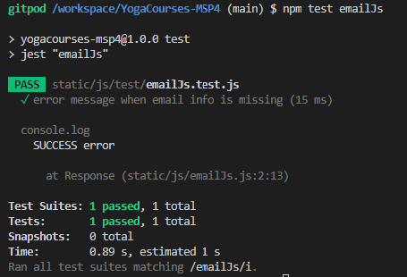
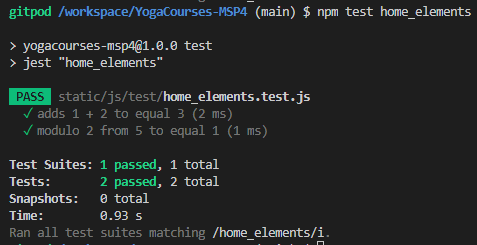

- #### **HTML Testing**
Using - W3C Markup Validator
Errors and Warnings in the .html files have been attended with the help of W3 .html Validator. After alterations, no major errors were found in the .html files; Most were related to the Django templates. The few slightly concerning errors have been documented below
| FILE | Result | Comment
--- | --- | --- |
base.html | [image](static/images/base.html-validator.png) | Only the errors regarding to the Django code left. W3validators does not recognize Django syntax as 
_footer.html | [image](static/images/course_list.validator.png) | Only the errors regarding to the Django code left. W3validators does not recognize django syntax as 
_navbar.html| [image](readme/images/w3_navigation.png) |Only the errors regarding to the Django code left. W3validators does not recognize Django syntax as , Also error 6 left, as When I try to change the Div it brakes the dropdown error
video_detail.html | [image](static/images/videodetailvalidator.png) | Only the errors regarding to the Django code left. W3validators does not recognize django syntax as 
home.html | [image](static/images/home.validator.png) | Only the errors regarding to the django code left. W3validators does not recognize django syntax as 
course_list.html | [image](static/images/course_list.validator.png) | Only the errors regarding to the django code left. W3validators does not recognize django syntax as 
course_detail.html | [image](static/images/course_detailvalidator.png) | Only the errors regarding to the django code left. W3validators does not recognize django syntax as 
register.html | [image](static/images/course_list.validator.png) | Only the errors regarding to the django code left. W3validators does not recognize django syntax as 
my_profile.html | [image](static/images/course_list.validator.png) | Only the errors regarding to the django code left. W3validators does not recognize django syntax as 
login.html | [image](static/images/course_list.validator.png) | Only the errors regarding to the django code left. W3validators does not recognize django syntax as 
bag.html | [image](static/images/bag.validator.png) | Only the errors regarding to the django code left. W3validators does not recognize django syntax as 
checkout_success.html | [image](static/images/sucess.validator.png) | Only the errors regarding to the django code left. W3validators does not recognize django syntax as 
checkout.html | [image](static/images/checkout.validator.png) | Only the errors regarding to the django code left. W3validators does not recognize django syntax as 

[top](#content)

- #### **CSS Testing**
| FILE | Result | Notes
--- | --- | --- |
navbar.css | [image](static/images/noerrors.css.png) | No errors Found
list.css | [image](static/images/noerrors.css.png) | No errors Found
home.css | [image](static/images/noerrors.css.png) | No errors Found
footer.css | [image](static/images/noerrors.css.png) | No errors Found
course_detail.css | [image](static/images/noerrors.css.png) | No errors Found
checkout.css | [image](static/images/noerrors.css.png) | No errors Found
card.css | [image](static/images/noerrors.css.png) | No errors Found
base.css | [image](static/images/noerrors.css.png) | No errors Found
bag.css | [image](static/images/noerrors.css.png) | 1 error found Value Error : font-weight 400px is not a font-weight value : 400px. Fixed

[top](#content)

- #### **PEP8 Testing**
* I used pep8online to check whether my .py file codes were PEP8 compliant. I made the changes needed for an All right pass for all .py files.

* I test all the views.py urls.py and models.py from all the apps.

* I have to left some errors as (E501: Line too long, and E711: comparison to None should be 'if cond is not None:')
as when I change it.
[top](#content)

- #### **User Stories Testing**
| AIM | Achieved | Image |
--- | --- | --- | 
**As a first time visitor to the website, I would like to..** 
Be able to browse through all the courses available for purchase | yes | [image1](static/images/Courselist.png) |
Be able to Search for specific courses via categories | yes | [image1](static/images/sorting.png) |
Be able to Know basic information of the Courses easily such as price, name etc | yes | [image1](static/images/Courselist.png) |
Be able to Read about the company of the website | yes | [image](static/images/about.png) |
Be able to communicate with the website as in email, contact number etc | yes | [image1](static/images/contact.png) |
Be able to Register to the website | yes | [image](static/images/register.png) |
Be able to procced with a secure online payment system | yes | [image](static/images/order succesfull.png) |
**As a registered member to the website, I would like to..** 
To be able to find the list of courses saved in their shopping cart | yes | [image](static/images/cart.png) |
To be able View and edit my shopping basket | yes | [image](static/images/cart.png) |
To have a page with my information given such as name, email, avatar | yes | [image](static/images/Profile.png)) | 
To be able to Purchase with ease and confidence | yes | [image]() |
**As a site owner/admin user, I would like to..**
Edit products on the websites for reasons such as typo errors, pricing etc | yes | [image](static/images/admin.png) |
Add and remove products | yes | [image delete 1](readme/images/delete_product.png) [image](static/images/admin.png) |
**As a user in the process of purchasing, I would like to..** 
A secured payment system | yes | |
Be acknowledged of how secure the process is for peace of mind | yes | |
Edit my basket such as deleting an item, changing the quantity etc | yes | |
Have a confirmation message | yes | |

[top](#content)

- #### **Cross Platfrom Testing**

- #### CRUD (create, read, update, delete) Testing
| AIM | admin | registered user | non-registered user |
--- | --- | --- | --- |
**Courses/art works - from content app**
CREATE a product to add to the database | yes | no(as intended) | no(as intended)
READ/see a product from the database on the website | yes | yes | yes
UPDATE a product | yes | no(as intended) | no(as intended)
DELETE a product | yes | no(as intended) | no(as intended)
**Bag - from bag app**
CREATE a shopping cart(Add products) | yes | yes | no(as intended)
READ the products in the Shopping cart | yes | yes | no(as intended)
UPDATE the products in the Shopping cart | yes | yes | no(as intended)
DELETE the products in the Shopping cart | yes | yes | no(as intended)
**Profile - from accounts app**
CREATE a Users Profile | yes | yes | no(as intended)
READ  username, email, avatar | yes | yes | no(as intended)
UPDATE username, email, avatar | yes | yes | no(as intended)
DELETE a Users Profile | yes | no | no(as intended)

[top](#content)

- #### Form Validation Testing
| AIM | SM | MD | LG |
--- | --- | --- | --- |
**Register** 
'First Name' field must only contain letters, numbers, and @/./+/-/_ characters | yes | yes | yes
'Last Name' field must only contain letters, numbers, and @/./+/-/_ characters | yes | yes | yes
'E-mail' field must have follow the pattern of have a '@' and a '.' in the email. It won't accept if it does not | yes | yes | yes
'Username' field must only contain letters, numbers, and @/./+/-/_ characters | yes | yes | yes
Both 'Password' fields must match | yes | yes | yes
**Login**
'Login' field must match with user from the database | yes | yes | yes
'Password' field must match with the password made for user entered in the 'Login' field | yes | yes | yes
**Checkout - checkout.html**
'Full Name' field will only accept upto 50 characters | yes | yes | yes
'E-mail' field must have follow the pattern of have a '@' and a '.' in the email | yes | yes | yes
'Phone Number' field will only accept numbers and a maximum of 20 numbers | yes | yes | yes
'Postcode' field will only accept up to 20 characters | yes | yes | yes
'Town or City' field will only accept up to 40 characters | yes | yes | yes
'Street Address 1' field will only accept up to 80 characters | yes | yes | yes
'Street Address 2' field will only accept up to 80 characters | yes | yes | yes
'County, State, or Locality' field will only accept up to 80 characters | yes | yes | yes
'Card number' field will only accept numbers | yes | yes | yes
**Add Course -**
'Category' will have a drop down containing options from the Category database | yes | yes | yes
'Price' will only accept numbers. It will take a numbers up to 4 digits in length | yes | yes | yes
'Price' will not go lower than 0 | yes | yes | yes
'Name' will allow up to 100 characters | yes | yes | yes
'Slug' will only allow up to 100 characters | yes | yes | yes
'Sub_title' will allow up to 200 characters | yes | yes | yes
'thumbnail' will be a URL field and it is possible to be empty | yes | yes | yes
'Description' will allow up to 500 characters | yes | yes | yes
'Active:'  will have a drop down containing options Yes and No | yes | yes | yes
'Is published' will be click box | yes | yes | yes
'Is featured' will be a click box | yes | yes | yes
**Contact us - _footer.html**
'Name' field will accept upto 100 characters | yes | yes | yes
'E-mail' field must have follow the pattern of have a '@' and a '.' in the email | yes | yes | yes
'Text' will allow up to 500 characters | yes | yes | yes

[top](#content)

- ### Lighthouse testing
I used Google Chrome Lighthouse testing to find out the quality of the website. Here are my results: [image](static/images/light House.png)

[top](#content)

- ### Responsive Testing
AIM | SM | MD | LG |
--- | --- | --- | --- |
**HOME - home.html**
Links / URLs | yes | yes | yes
Images | yes | yes | yes
Renders as expected | yes | yes | yes
**COURSES - course_list.html**
Links / URLs | yes | yes | yes
Images | yes | yes | yes
Renders as expected | yes | yes | yes
**COURSE DETAIL - course_detail.html**
Links / URLs | yes | yes | yes
Images | yes | yes | yes
Renders as expected | yes | yes | yes
Form validation | yes | yes | yes
**VIDEO DETAIL - video_detail.html**
Links / URLs | yes | yes | yes
Images | yes | yes | yes
Renders as expected | yes | yes | yes
Form validation | yes | yes | yes
**BAG - bag.html**
Links / URLs | yes | yes | yes
Images | yes | yes | yes
Renders as expected | yes | yes | yes
Form validation | yes | yes | yes
**PROFILE - my_profile.html**
Links / URLs | yes | yes | yes
Images | yes | yes | yes
Renders as expected | yes | yes | yes
**PROFILE - login.html**
Links / URLs | yes | yes | yes
Renders as expected | yes | yes | yes
**PROFILE - register.html**
Links / URLs | yes | yes | yes
Renders as expected | yes | yes | yes
**CHECKOUT - checkout.html**
Links / URLs | yes | yes | yes
Images | yes | yes | yes
Renders as expected | yes | yes | yes
**CHECKOUT SUCCESS - checkout_success.html**
Links / URLs | yes | yes | yes
Images | yes | yes | yes
Renders as expected | yes | yes | yes

- ### Jest Test Testing Javascript:

- ##### I used Jest test to set some of the functions I create with Javascript.

I didnt mannage to test jQuery Code. So create some Mock Function to do the testing

- ### Django test Testing Python code, views and Models:

- ##### I used Django tests to set some models and views I cretes  with Python.

[Test Commit](https://github.com/Manuperezro/YogaCourses-MSP4/commit/a88b036998cb1502d1df75f4ba57c19b959e9850/)

[top](#content)

- ### Bugs and Fixes
ISSUE | Solved? | How? | link
--- | --- | --- | --- | 
Some of imgs wasn’t rendering after Hosting files in AWS S3 | Yes | I found a solution in Slack overflow: I had to change the src in the imgs fields and used a Django Pattern  instead | (https://github.com/Manuperezro/YogaCourses-MSP4/commit/d84d53b355f8b56f28f233ca72368e83ce7b9994) 
Courses(Products form Stripe not rendering | yes | Thanks to one of the amazing tutors I realize that it was a Json object, So I import Json, created and empty list to storage the objects and them append the Products. | (https://github.com/Manuperezro/YogaCourses-MSP4/commit/3e731f54a30dcf01702d40e20ca69791c1203da2)
Hero video Not rendering | yes | It wasn't working because the video was storage in the media_root file, I did move into the static, and create a folder named video. Also used the  tag and them simply used the relative file path of the video.mp4 in the vide src  |(https://github.com/Manuperezro/YogaCourses-MSP4/commit/e4510a2c50a2af0876c8003a8c6c8208fa2eff16)
Sections not working when I tried to add a new video to the courses | yes | The foreign key in the Sections modal wrong, I was using the Category model instead of Course model | (https://github.com/Manuperezro/YogaCourses-MSP4/commit/8ba099f8a27182579c68e53bb8d4636c918031f8)
YouTube Videos not rendering | Yes | I found a tutorial in google which help me to realize I wasn't copying the right url from YouTube, I had to copy  the embed video url, not the video url | (https://startcodingnow.com/embedding-videos-into-django-project/#:~:text=Install%20the%20package%20pip%20install%20django-embed-video%20Change%20settings.py,%28...%20%27embed_video%27%2C%29%20Add%20the%20field%20to%20your%20model)
Checkout messages showing in the Login form | Yes | I found a way of clearing the other messages and just hd to add a couple of lines of code <  storage = messages.get_messages(request) / storage.used = True>  | (https://github.com/Manuperezro/YogaCourses-MSP4/commit/81d802fa03325552721f507c3e0ab8186a732590)

### Remainding Errors in the Google Developers Tool Console:

- The only errors shows in the console in google developers tool, are related to the Jest test Mock functions I created to test the code. They don't affect the User's interactivity with the site.